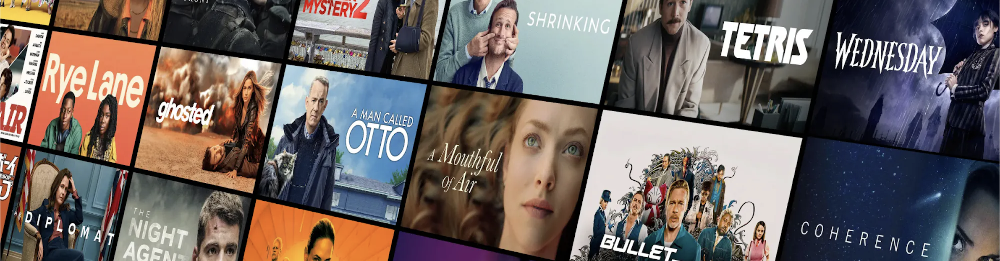
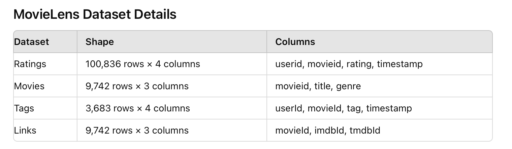
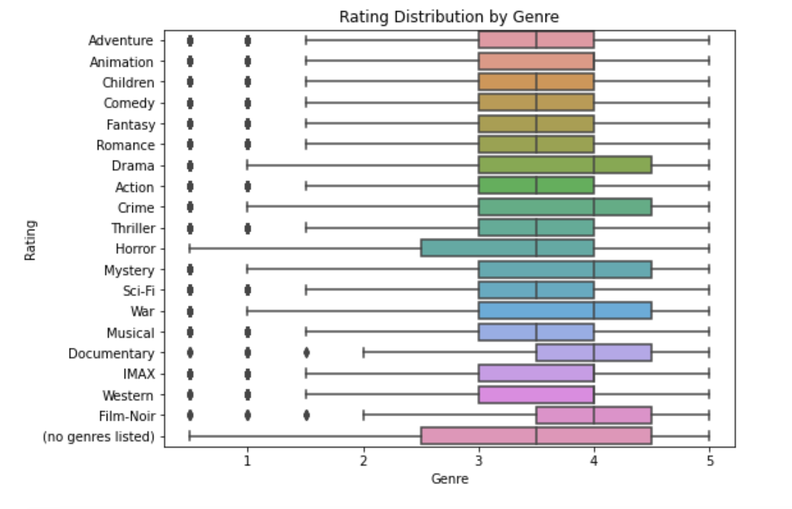
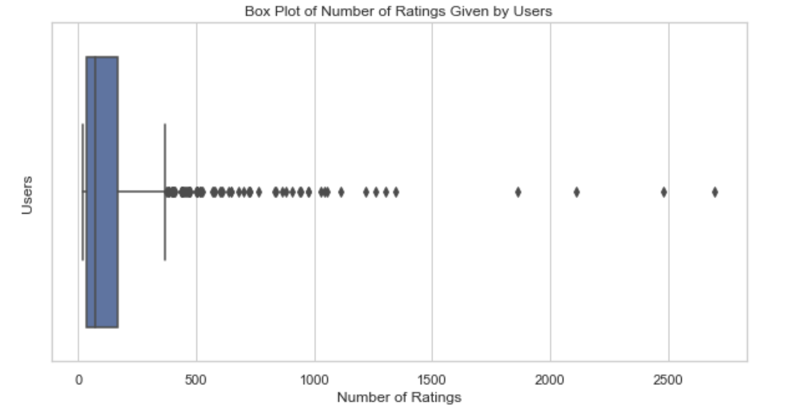
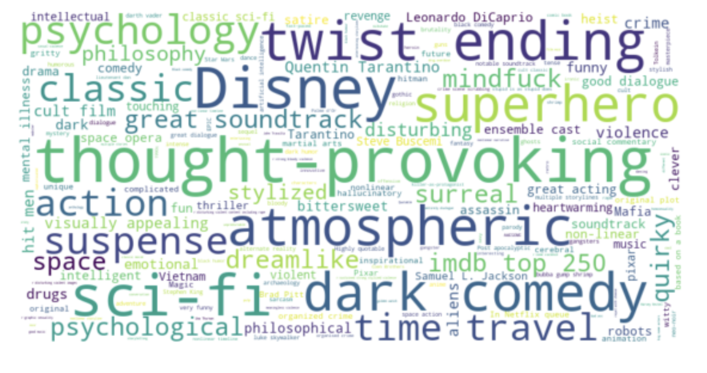
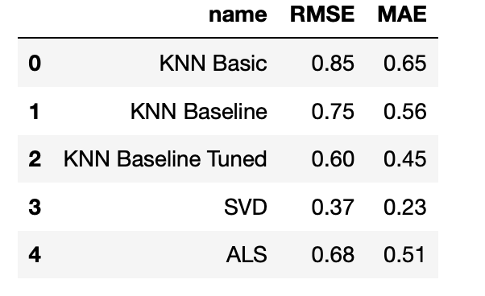

## Project Overview

The goal of this project is to develop a movie recommendation system leveraging the MovieLens dataset, which includes user ratings, tags and movies data. The system aims to enhance user experience by providing personalized movie suggestions based on user preferences and viewing history.

The project will utilize machine learning algorithms to predict user ratings for movies that they have not yet watched. These predictions will be based on the analysis of historical data from a data set of users and movies.

The primary metric for evaluating the effectiveness of the recommendation system will be the Root Mean Square Error (RMSE) and Mean Absolute Error (MAE), which will help in assessing the accuracy of the predictions.

The development process will involve data cleaning and data preprocessing to handle missing values and bring data to a comvinient format, feature engineering to tranform necessaary data, exploratory data analysis to understand underlying patterns, and the implementation of several recommendation algorithms such as collaborative filtering, content-based filtering, and hybrid methods. The performance of these models will be compared to select the most effective approach.

## Stakeholder

Tubi is a free ad-supported streaming service. Company wants to improve user engagement and retention by providing personalized movie recommendations based on user preferences and viewing history.

## Business Questions

* How can machine learning be used by online movie streaming services for movie recommendations to users?
* What ML model make best movie predicitons for users?

## Objectives

* Develop several recommendation models: collaborative filtering, content based filtering, hybrid
* Achieve high prediction accuracy
* Compare and evaluate algorithms
* Suggest solution for cold start problem
* Provide business recommendation for the stakeholder

## Data used

Chosen dataset (ml-latest-small) describes 5-star rating and free-text tagging activity from MovieLens, a movie recommendation service.

## EDA

Distribution of ratings among genres

Number of ratings given by user

WordCloud for movie tags

## Best model 

**Collaborative Filtering**: SVD Matrix Factorization

We have successfully implemented several models and picked the best performing - Singular Value Decomposition (SVD) for matrix factorisation.

Through tuning hyperparameters, we optimized the model's performance, achieving a significant reduction in RMSE and MAE compared to baseline model (KNN Basic Used Based).

**Content-Based Filtering:**
Content-based filtering was incorporated to enhance recommendations by leveraging movie attributes such as genre, title and tags. We used TF-IDF for creating vectors and NearestNeighbor algorithm for clustering using cosine similarity.

## Recommendations
Introduce recommendation system based on SVD Matrix Factorisation with tuned hyperparameters.
Introduce content based filtering.

## Nest Steps

To further enhance our movie recommendation system and ensure its effectiveness, we propose the following next steps:

**Collect Data and Evaluate Changes:**
* Monitor and analyze key performance indicators such as user engagement, viewing time, user retention, and ad revenue.
* Utilize this data to assess the impact of the recommendation system and identify areas for improvement.

**Introduce Users' Demographic Data:**
* Incorporate demographic information such as age, gender, and location to better understand our audience.
* Use this data to refine recommendations and make them more relevant to different user segments.

**Collect User Feedback:**
* Gather feedback from users regarding the recommendations provided.
* Use surveys, ratings, and direct feedback mechanisms to understand user satisfaction and preferences.

**Develop Hybrid Model:**
* Combine SVD Matrix Factorisation and content-based filtering with other techniques to create a hybrid recommendation model.
* This hybrid approach will leverage the strengths of multiple methodologies to deliver even more accurate and personalized recommendations.
